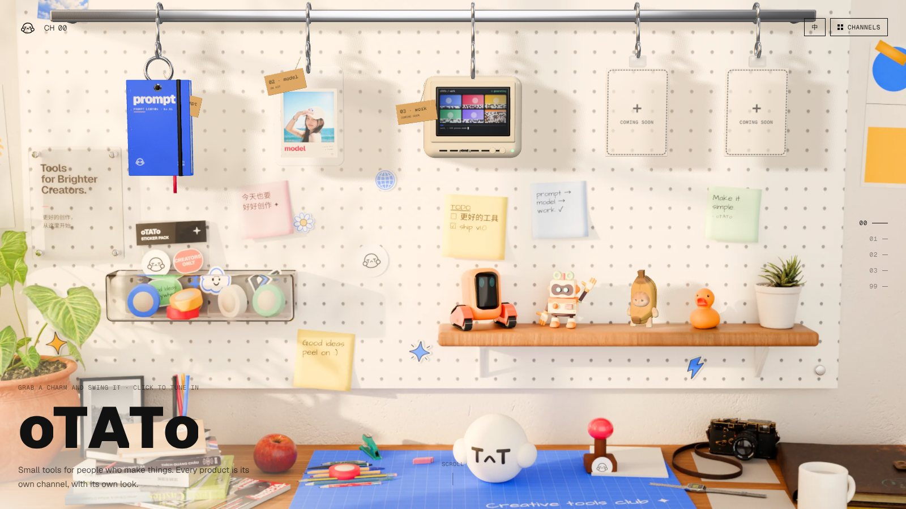

<div align="center">

# 去皮土豆 oTATo · otato.art

**给创作者的小工具。每个产品是一个频道，各有各的样子。**

Small tools for people who make things. Every product is its own channel, with its own look.

[otato.art](https://otato.art) · [English](https://otato.art/en)



</div>

---

## 这是什么

otato.art 是去皮土豆 oTATo 的品牌官网，也是旗下产品的入口。网站像一台电视：往下滚就是换台，每个频道一个产品，每一屏都是完全不同的视觉风格。

| 频道 | 产品 | 状态 |
| --- | --- | --- |
| 00 | 开场 · 创作者工作台 | — |
| 01 | [oTATo prompt](https://prompt.otato.art) · macOS 提示词资料库 | 试播 |
| 02 | [oTATo model](https://model.otato.art) · AI 模特写真与商拍换装 | 直播中 |
| 03 | [oTATo work](https://work.otato.art) · 开源 AI 创作工作台 | 即将开播 |
| 99 | 关于 | — |

## 开场：一张会动的照片

开场的工作台是 Blender（Cycles）渲出来的写实照片，但上面的挂件是活的：

- **同一个机位**：Blender 里的相机参数导出给 three.js，实时 3D 和照片严丝合缝地叠在一起。
- **挂件可以甩**：钩子套在挂杆上，鼠标划过会被带着晃，抓住能甩，有钟摆物理和扭转，影子实时投在洞洞板上。点一下飞到镜头前，换到对应频道。
- **显示器在"生成"**：work 挂件的复古小屏幕一直在从噪点里长出新作品。
- **香蕉猫在跑**：架子上的香蕉猫是带骨骼动画的实时模型；其它玩具碰一下会晃、点一下会跳。
- **很轻**：全站静态导出；开场的 3D 模型经 meshopt 压缩后合计约 400KB，背景图约 150KB。

## 技术

Next.js 16（静态导出）· React 19 · Tailwind CSS 4 · three.js · Blender 5（Cycles）

字体都打包在项目里，不依赖外部字体服务：Geist、Geist Mono、Geist Pixel，中文用思源黑体（Noto Sans SC）。

## 本地运行

需要 Node.js 20 以上。第一次在项目目录里运行一次（之后在任何目录都能用 `otato` 命令）：

```bash
npm link
otato art dev        # 打开 http://localhost:4100
```

也可以直接 `npm install && npm run dev`。

| 命令 | 作用 |
| --- | --- |
| `otato art dev` | 本地开发 |
| `otato art check` | 推送前检查：代码检查 + 类型检查 + 构建 |
| `otato art publish` | 把 Blender 导出的开场素材处理成网站版本 |
| `otato art build` | 构建静态网站到 `out/` |

快捷键：↑ ↓ 换台，数字键直达频道，M 打开频道列表。

## 目录

```
src/app/(zh)/          中文页面（/）
src/app/(en)/en/       英文页面（/en）
src/channels/          各产品频道：每个频道一个文件夹（meta.ts + Screen.tsx）
src/shell/             品牌壳：台标、换台、开机、频道列表、关于、开场工作台
src/content/           社媒链接、更新记录
public/                网页实际加载的文件（图片、字体、3D 模型）
3d/workbench/          开场工作台的 Blender 工程和脚本
scripts/               命令行工具、素材处理脚本
docs/                  部署规则、3D 出图流程
```

## 加一个新频道

1. 在 `src/channels/` 下新建文件夹，放两个文件：
   - `meta.ts`：名称、频道号、中英文案、链接、状态（`live` 直播中 / `test` 试播 / `soon` 即将开播）、主题色
   - `Screen.tsx`：这个频道的画面，完全按产品自己的品牌来做
2. 在 `src/channels/index.ts` 里加一行。

品牌壳会自动读取新频道。别的要改的地方：社媒链接 `src/content/site.ts`，更新记录 `src/content/updates.ts`，品牌文案 `src/lib/i18n.ts`。

## 文档

- [部署与协作规则](docs/DEPLOY.md)：分支、预览、上线、回滚、素材体积
- [开场工作台出图流程](docs/3D-PIPELINE.md)：Blender 场景 → 导出 → 调色压缩 → 网页

## 版权与授权

- **代码**：MIT 协议，见 [LICENSE](LICENSE)。欢迎学习、改造、拿去做你自己的东西。
- **品牌与内容不在开源范围内**：「去皮土豆」「oTATo」名称、logo、T^T 形象、照片、渲染图、文案和产品介绍，保留所有权利。请不要使用这些品牌元素，也不要原样照搬这个网站；在此基础上做二次创作没问题。详见 [NOTICE.md](NOTICE.md)。

### 第三方素材

开场工作台用到的第三方 3D 模型，按授权要求署名（网页上鼠标停在对应模型上也会显示）：

| 模型 | 作者 | 授权 |
| --- | --- | --- |
| [Cute Little Robot](https://sketchfab.com/3d-models/cute-little-robot-07a6bdfcfde44565a259be970000d2a3) | Felix Yadomi | [CC BY 4.0](https://creativecommons.org/licenses/by/4.0/) |
| [Cute Cat in Cute Banana](https://sketchfab.com/3d-models/cute-cat-in-cute-banana-fb3eee24c9fc422ea256b95d5148931f) | SOBOL | [CC BY 4.0](https://creativecommons.org/licenses/by/4.0/) |
| [机器人](https://sketchfab.com/3d-models/7b2c536669ff4f479c1a185e879b7aac) | 逍遥开发小组 | [CC BY 4.0](https://creativecommons.org/licenses/by/4.0/) |

以上模型在网站中经过缩放、调整姿态、重新上材质和压缩。

其余模型、贴图和环境光（植物、书、相机、台灯、文具、橡皮鸭、木纹、墙面、天空等）来自 [Poly Haven](https://polyhaven.com) 和 [ambientCG](https://ambientcg.com)，CC0 授权；马克杯、挂件、亚克力牌、置物架等是用 Blender 脚本自己建的。字体 Geist 系列、Noto Sans SC、Architects Daughter 均为 SIL Open Font License；three.js 为 MIT。
